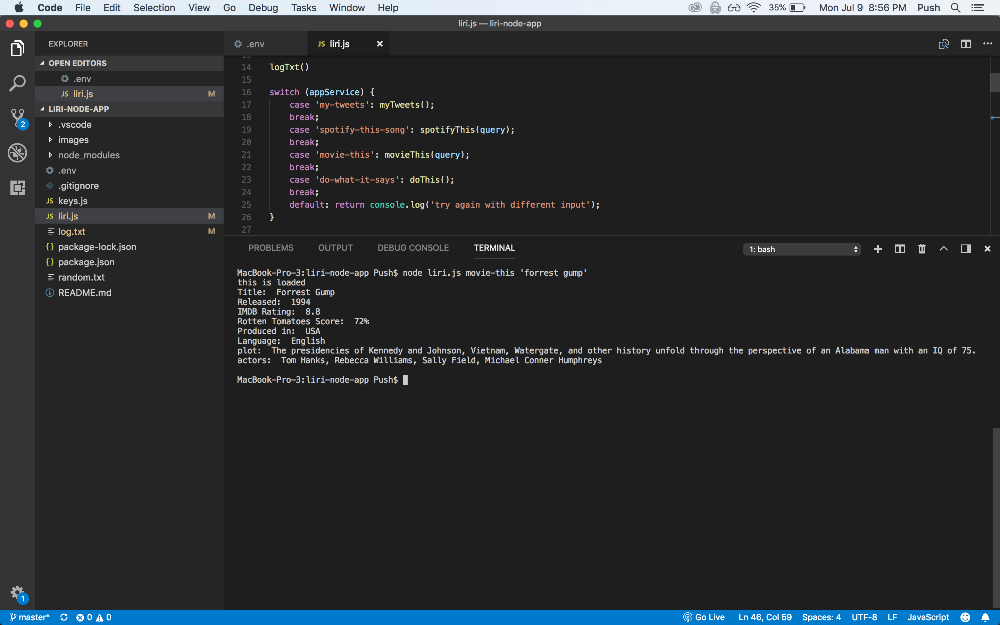

# Liri Bot node assignment
Using the Twitter, Spotify, Request, OMDB and DotEnv packages, I created an app that will allow users to enter command line arguments to return specific output from each package. 

## Functionality
Through the terminal, the user can call one of the specific commands to:

 - 'my-tweets': Return the latest 20 tweets from Twitter
 - 'spotify-this-song' & 'song name': Return top 3 results from Spotify about the song title.
	 - If there is no second argument (i.e. song name), it defaults to get results for The Sing from Ace of Base.
 - 'movie-this' & 'movie title': Returns information about the movie searched.
	 - If there is no movie entered into the second argument it will return results about the movie 'Mr. Nobody.'
 - 'do-what-it-says':  Calls a function that reads text from a different file and performs the Spotify search based on the contents of that file.
 - Entering no information will prompt the user to try again.

Each time a command is entered, a function is run to log the command and the time it was run in a log.txt file. 

## Results:

